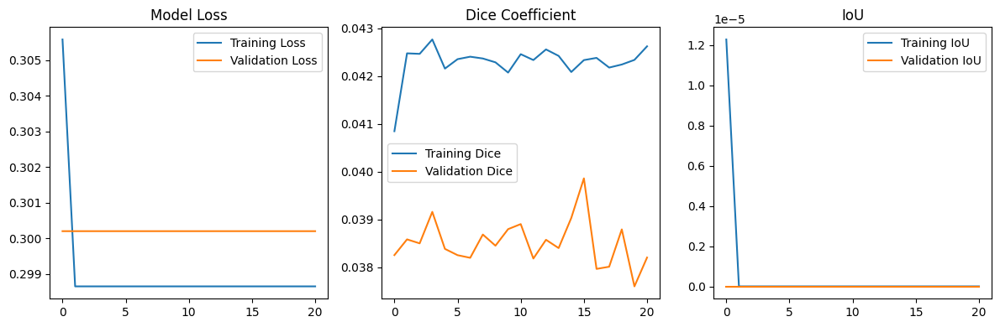

# ✨ UNetSegmentation ✨: AI for Medical Image Analysis 🧠🔬

[](https://opensource.org/licenses/MIT) <!-- Replace with your actual license badge -->
[](https://www.python.org/downloads/) <!-- Adjust Python version if needed -->
<!-- Add more badges like build status, code coverage, etc. if you have them -->
<!-- [](https://travis-ci.com/TheRealSaiTama/UNetSegmentation) -->
<!-- [](https://coveralls.io/github/TheRealSaiTama/UNetSegmentation?branch=main) -->

**Welcome to the cutting-edge U-Net model for precise medical image segmentation! This project aims to identify and delineate regions of interest (like tumors in MRI scans) with high accuracy.**

---

<!-- **💡 Tip:** Replace this placeholder with a compelling GIF showcasing your model segmenting an image! -->


---

## 🚀 Features

*   **State-of-the-Art Model:** Implements the renowned U-Net architecture, specifically tailored for biomedical segmentation.
*   **High Accuracy:** Designed to achieve precise pixel-level segmentation.
*   **Flexible:** Adaptable to various medical imaging modalities (MRI, CT, X-ray - specify what you've tested).
*   **Easy to Use:** Streamlined scripts for training and inference.
*   **Extensible:** Modular code structure for easy experimentation and modification.

---

## 🏗️ Model Architecture: The U-Net

The U-Net architecture is famous for its effectiveness in biomedical image segmentation. It consists of:

1.  **Contracting Path (Encoder):** Captures context through convolutional and max-pooling layers.
2.  **Expanding Path (Decoder):** Enables precise localization using transposed convolutions.
3.  **Skip Connections:** Merge high-resolution features from the encoder with the decoder path, crucial for detail preservation.

<details>
<summary>📊 Click to see a simplified diagram concept</summary>

```mermaid
graph LR
    A[Input Image] --> B(Encoder Block 1);
    B --> C(Downsample 1);
    C --> D(Encoder Block 2);
    D --> E(Downsample 2);
    E --> F(Bottleneck);
    F --> G(Upsample 1);
    G --> H(Decoder Block 1);
    H --> I(Upsample 2);
    I --> J(Decoder Block 2);
    J --> K[Output Mask];

    D --> H; % Skip Connection 1
    B --> J; % Skip Connection 2
```
</details>

---

## 🛠️ Installation

Get up and running in a few steps:

1.  **Clone the repository:**
    ```bash
    git clone https://github.com/TheRealSaiTama/UNetSegmentation.git
    cd UNetSegmentation
    ```

2.  **Create a virtual environment (recommended):**
    ```bash
    python -m venv venv
    source venv/bin/activate  # On Windows use `venv\Scripts\activate`
    ```

3.  **Install dependencies:**
    ```bash
    pip install -r requirements.txt
    ```
    *(Ensure you have PyTorch/TensorFlow installed according to your system's CUDA requirements if using GPU.)*

---

## 💾 Dataset

This model expects medical images and their corresponding segmentation masks.

*   **Source:** Where can users get the dataset? (e.g., BraTS, LiTS, or your custom dataset link). Add links!
*   **Format:** What format should the images and masks be in? (e.g., NIfTI, DICOM, PNG).
*   **Structure:** How should the data be organized in the directory?
    ```
    data/
    ├── train/
    │   ├── images/
    │   │   ├── image_001.png
    │   │   └── ...
    │   └── masks/
    │       ├── mask_001.png
    │       └── ...
    ├── validation/
    │   ├── images/
    │   └── masks/
    └── test/
        ├── images/
        └── masks/
    ```
    *(Adjust the structure above to match your `DataLoader`)*

---

## ⚙️ Usage

<details>
<summary>🧠 Training the Model</summary>

To train the U-Net model on your dataset:

```bash
python train.py --data_path /path/to/your/data --epochs 50 --batch_size 4 --learning_rate 1e-4
```

**Configuration:**

*   `--data_path`: Path to the root directory of your dataset.
*   `--epochs`: Number of training epochs.
*   `--batch_size`: Training batch size.
*   `--learning_rate`: Initial learning rate.
*   *(Add any other important training arguments here)*

Checkpoints and logs will be saved in the `outputs/` directory (or specify location).
</details>

<details>
<summary>🔬 Performing Inference (Segmentation)</summary>

To use a trained model to segment new images:

```bash
python inference.py --model_path /path/to/your/trained_model.pth --input_dir /path/to/input/images --output_dir /path/to/save/masks
```

**Arguments:**

*   `--model_path`: Path to the trained model checkpoint (`.pth`, `.h5`, etc.).
*   `--input_dir`: Directory containing the images you want to segment.
*   `--output_dir`: Directory where the predicted segmentation masks will be saved.
*   *(Add any other relevant inference arguments)*
</details>

---

## 🙌 Contributing

Contributions are welcome! Whether it's bug fixes, feature additions, or documentation improvements, please feel free to:

1.  Fork the repository.
2.  Create a new branch (`git checkout -b feature/YourFeature`).
3.  Make your changes.
4.  Commit your changes (`git commit -m 'Add some feature'`).
5.  Push to the branch (`git push origin feature/YourFeature`).
6.  Open a Pull Request.

Please check the `CONTRIBUTING.md` file (if you create one) for more detailed guidelines. You can also open an issue to discuss potential changes.

---

## 📜 License

This project is licensed under the MIT License - see the [LICENSE](LICENSE) file for details. <!-- Make sure you have a LICENSE file -->

---

Made with ❤️ by TheRealSaiTama.
